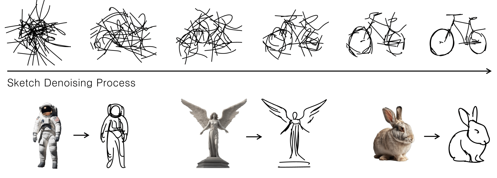

# SwiftSketch: A Diffusion Model for Image-to-Vector Sketch Generation

<p align="center">

</p>

*SwiftSketch is a diffusion model that generates vector sketches by denoising a Gaussian in stroke coordinate space. It generalizes effectively across diverse classes and takes under a second to produce a single high-quality sketch.*

#### Ellie Arar, Yarden Frenkel, Daniel Cohen-Or Ariel Shamir, Yael Vinker 

> Recent advancements in large vision-language models have enabled highly expressive and diverse vector sketch generation. However, state-of-the-art methods rely on a time-consuming optimization process involving repeated feedback from a pretrained model to determine stroke placement. Consequently, despite producing impressive sketches, these methods are limited in practical applications. In this work, we introduce SwiftSketch, a diffusion model for image-conditioned vector sketch generation that can produce high-quality sketches in less than a second. SwiftSketch operates by progressively denoising stroke control points sampled from a Gaussian distribution. Its transformer-decoder architecture is designed to effectively handle the discrete nature of vector representation and capture the inherent global dependencies between strokes. To train SwiftSketch, we construct a synthetic dataset of image-sketch pairs, addressing the limitations of existing sketch datasets, which are often created by non-artists and lack professional quality. For generating these synthetic sketches, we introduce ControlSketch, a method that enhances SDS-based techniques by incorporating precise spatial control through a depth-aware ControlNet. We demonstrate that SwiftSketch generalizes across diverse concepts, efficiently producing sketches that combine high fidelity with a natural and visually appealing style.


<a href="https://arxiv.org/abs/2502.08642"></a> 
<a href="https://swiftsketch.github.io/"></a> 

[**Download the ControlSketch dataset**](https://drive.google.com/drive/folders/1L5kubR416QoTD_UAqH2FtSgNL4leUcys)


## 🔥 NEWS
**`2025/04/29`**: The ControlSketch code is released!

**`2025/02/12`**: The ControlSketch dataset is released!

**`2025/02/12`**: Paper is out!


## Installation

1.  Clone the repo:
```bash
git clone https://github.com/swiftsketch/swiftsketch.git
cd swiftsketch
```

2. Create a new environment:
```bash
conda create -n swiftsketch_env python=3.9.19 -y
conda activate swiftsketch_env
```

3. Install diffvg:
Please follow their [installation guide](https://github.com/BachiLi/diffvg?tab=readme-ov-file#install)


4. Install the libraries:
```bash
pip install torch==2.3.1 torchvision==0.18.1 torchaudio==2.3.1 --index-url https://download.pytorch.org/whl/cu121
pip install -r requirements.txt
pip install git+https://github.com/openai/CLIP.git
```


## ControlSketch
```bash
cd ControlSketch
```

To sketch your own image using the optimization method, ControlSketch, from ControlSketch run:
```bash
python object_sketching.py --target <file path>
```
The target can be one of the following:
1. An image file.
2. A dictionary created by the make_sdxl_data.py script, which contains the following keys: image, mask, attn_map, and caption.

The final sketch will be saved in the output_sketches folder.
If the input is a dictionary, the sketch will also be added to the dictionary.

Optional arguments:
* ```--num_strokes``` Defines the number of strokes used to create the sketch, which determines the level of abstraction. The default value is set to 32, but for different images, different numbers might produce better results. 
* ```--fix_scale``` If your image is not squared, it might be resized, it is recommended to use this flag with 1 as input to automatically fix the scale without risuzing the image.
* ```--object_name``` the word for extracting the object cross attention map for strokes intialization. If this is not given, it uses clip attention.
* ```--capiton``` can be a more precise caption of the object and its position. If this is not given, a model will be used to generate the caption.
* ```--use_cpu``` If you want to run the code on the cpu (not recommended as it might be very slow).


<br>
<b>For example, below are optional running configurations:</b>
<br>

Sketching the lion with defauls parameters:
```bash
python object_sketching.py --target "./data/lion.png"
```
Sketching the lion with defauls parameters with a given object_name and a caption:
```bash
python object_sketching.py --target "./data/lion.png" --object_name "lion" --capiton "lion standing"
```
Sketching the cat with defauls parameters using a dictionary target:
```bash
python object_sketching.py --target "./data/cat.npz"
```
Sketching the elephent which is not squared using fix scale:
```bash
python object_sketching.py --target "./data/elephent.png" --fix_scale 1 
```

## Data Creation

To generate a data sample using SDXL run:
```bash
python make_sdxl_data.py --obj <object to generate> 
```
Each generated sample is saved as a dictionary with the following keys:

- **`image`**: The generated image.
- **`mask`**: The corresponding mask.
- **`attn_map`**: The attention map.
- **`caption`**: The caption of the generated image.

The data samples will be saved in the SDXL_samples folder.

Optional arguments:

* ```--num_of_samples```  Number of samples to generate for the given object using different seeds. Default is 1.
* ```--save_compressed_dict```  If set to 0, the output dictionary is saved in uncompressed .npy format. By default, data is saved in compressed .npz format.
* ```--output_dir```  Directory to save the output dictionaries. If not specified, the output will be saved in the SDXL_samples folder.

<br>
<b>For example:</b>
<br>

Generating 10 samples of a cat and save them to a specified directory::
```bash
python make_sdxl_data.py --obj "cat" --output_dir "path/to/output/dir" --num_of_samples 10
```

## SwiftSketch
```
Comming soon
```

## Citation
If you make use of our work, please cite our paper:

```
@misc{arar2025swiftsketchdiffusionmodelimagetovector,
      title={SwiftSketch: A Diffusion Model for Image-to-Vector Sketch Generation}, 
      author={Ellie Arar and Yarden Frenkel and Daniel Cohen-Or and Ariel Shamir and Yael Vinker},
      year={2025},
      eprint={2502.08642},
      archivePrefix={arXiv},
      primaryClass={cs.CV},
      url={https://arxiv.org/abs/2502.08642}, 
}
```

